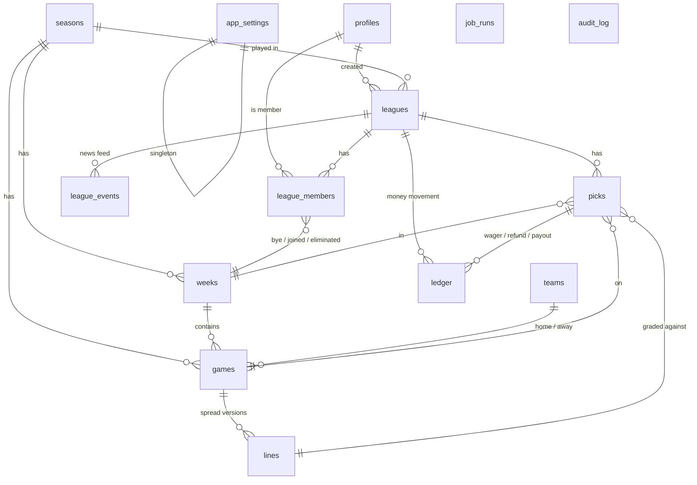

# Database and data model

Everything the app knows lives in one Supabase Postgres database. This document describes the
schema as it exists in `supabase/migrations/`, the rules the database enforces on its own, and how
to work with it. Read [SECURITY.md](../SECURITY.md) before changing anything here.

- [Principles](#principles)
- [Entity overview](#entity-overview)
- [Tables](#tables)
- [Enums](#enums)
- [Money: the ledger and weekly budgets](#money-the-ledger-and-weekly-budgets)
- [Functions (the API of the database)](#functions-the-api-of-the-database)
- [Triggers](#triggers)
- [Row-level security](#row-level-security)
- [Storage](#storage)
- [Migrations](#migrations)
- [Testing the database](#testing-the-database)

## Principles

1. **Every table has RLS, default deny.** The web app connects as the signed-in user, so Postgres
   is the authorization layer. `anon` has no privileges on application tables. Grants are per
   column, so a member can change their own `display_name` but not `is_site_admin`.
2. **Every write that matters is a function.** Members never insert into `picks` or `ledger`.
   They call `place_pick()`, which runs in one transaction with a row lock and checks every rule
   in `docs/RULES.md`. The functions are `security definer` with a pinned `search_path = ''`.
3. **Money is integer cents** and the ledger is append-only. A balance is `sum(amount_cents)`;
   nothing is ever updated in place, so a dispute can always be replayed row by row.
4. **Two audit trails.** `audit_log` stores before/after JSON for every change to sensitive
   tables (via trigger); `league_events` is the human-readable news feed.
5. **Jobs and admins are "operators".** Settlement, voiding a game, the weekly action check and
   deadline recompute require `service_role` (the Python jobs) or a site admin
   (`require_operator()`).
6. **IDs are UUIDs** (`gen_random_uuid()`), except the two append-only logs which use `bigint`
   identities because they are written in order and never referenced by other tables.

## Entity overview

Reference data (`seasons`, `weeks`, `teams`, `games`, `lines`) is shared by every league. League
data (`leagues`, `league_members`, `picks`, `ledger`, `league_events`) is per league. A user is a
`profiles` row (1:1 with `auth.users`) and can belong to many leagues.

## Tables

Column types: `uuid`, `text`, `int` (integer), `smallint`, `bool`, `ts` (timestamptz, always UTC),
`jsonb`. `?` marks nullable. Every table with `updated_at` has a trigger that maintains it.

### profiles

One row per auth user, created by the `on_auth_user_created` trigger on `auth.users`.

| Column          | Type  | Notes                                                                      |
| --------------- | ----- | -------------------------------------------------------------------------- |
| `id`            | uuid  | PK, = `auth.users.id`, cascades on delete                                  |
| `display_name`  | text  | 2–32 chars; defaults to sign-up metadata, else the email's local part      |
| `avatar_path`?  | text  | Object key in the `logos` bucket, must be `<own uid>/<file>` (trigger)     |
| `is_site_admin` | bool  | Only the service role can set it (column not granted to `authenticated`)   |

### app_settings

Single row (`id = 1`). Site-wide rules; editable by site admins in `/admin/settings`.

| Column                           | Default            | Meaning                                                         |
| -------------------------------- | ------------------ | --------------------------------------------------------------- |
| `spread_lock_day`                | 3 (Wednesday)      | 0 = Sunday … 6 = Saturday                                       |
| `spread_lock_time`               | 08:00              | Local time (site timezone) the line-lock job first runs         |
| `timezone`                       | America/New_York   | Drives deadlines; limited to seven US zones by a check          |
| `default_starting_balance_cents` | 1,000,000 ($10k)   | Offered when a league is created                                |
| `bet_unit_cents`                 | 100,000 ($1k)      | Wagers must be whole multiples                                  |
| `hide_picks_until_kickoff`       | false              | When true, league-mates' picks are hidden until the deadline    |
| `odds_provider`                  | the_odds_api       | Reserved for Phase 2                                            |
| `score_poll_interval_s`          | 60                 | Reserved for the live-score job (Phase 2)                       |

### seasons, weeks, teams, games, lines (reference data)

**seasons** – `year` (unique), `regular_season_weeks` (default 18), `playoffs_start_at`?,
`is_active`. A partial unique index allows exactly one active season.

**weeks** – `season_id`, `week_number` (1–22, unique per season), `opens_at`?, `spread_lock_at`?
(set by `sync_schedule` from the settings), and rollups maintained by trigger from `games`:
`first_kickoff_at`, `last_kickoff_at`, `last_game_id`, `last_deadline_at` (the deadline of the
week's last non-void game, which is when the bye / forced-pick check fires). `settled_at`? is
stamped by `settle_week`; `action_checked_at`? by `weekly_action_check`.

**teams** – the 32 NFL teams, seeded by migration: `espn_team_id` (unique), `abbreviation`
(unique, 2–4 caps), `location`, `name`, `display_name`, `conference`, `division`, `logo_url`?.

**games** – one per ESPN event (`espn_event_id` unique). `season_id`, `week_id`, `home_team_id`,
`away_team_id`, `kickoff_at`, `deadline_at` (**maintained by trigger**: 23:59 in the site timezone
on the day before kickoff, RULES.md #9), `neutral_site`, `status` (`game_status`),
`status_detail`?, `home_score`?, `away_score`?, `period`?, `clock`?, `last_synced_at`?.

**lines** – immutable spread versions. `game_id`, `home_spread` (numeric, half points, −60..60;
negative = home favoured), `price` (reserved), `source` (`api` = ESPN consensus, `admin` = matched
to the New York Post by hand), `set_by`?, `locked_at`, `is_current`. A partial unique index keeps
exactly one current line per game; `set_line()` flips the old one off and inserts the new one.
Picks reference the *specific* line row they were made against, so a later edit never changes an
existing bet.

### leagues

| Column                   | Notes                                                                 |
| ------------------------ | --------------------------------------------------------------------- |
| `season_id`              | Leagues belong to one season                                          |
| `name`                   | 2–48 chars                                                            |
| `invite_code`            | 8 chars from `A–Z2–9` (no 0/O/1/I), unique; rotate via function       |
| `created_by`             | The first commissioner                                                |
| `starting_balance_cents` | Positive; changing it before play starts rebases balances             |
| `status`                 | `open` → `complete` (`locked` reserved)                               |
| `winner_user_id`?        | Set by `settle_week` when the league completes                        |
| `archived_at`?           | Set by `archive_league()` (site admin): hidden from members, no picks or joins, skipped by settlement; reversible |

### league_members

`league_id` + `user_id` unique. `role` (`member` / `commissioner`, several commissioners allowed),
`joined_week_id`? (the current week at join time, so the action check does not force picks for a
week that was already closed), `bye_week_id`? (the one bye, RULES.md #6), `eliminated_at`? and
`eliminated_week_id`? (RULES.md #7), `left_at`? (soft leave, so the ledger stays append-only and a
rejoin restores the same row).

### ledger

Append-only (update/delete raise for every role). `league_id`, `user_id`, `week_id`? (null for
the initial balance and adjustments), `pick_id`? (soft reference: the pick may since have been
removed), `kind` (`ledger_kind`), `amount_cents` (signed), `note`?.

| kind         | sign | written by                                             |
| ------------ | ---- | ------------------------------------------------------ |
| `initial`    | +    | `create_league` / `join_league` (one per member, index) |
| `wager`      | −    | `place_pick` (and again when a pick is edited)          |
| `refund`     | +    | pick edited or removed, or the game is void             |
| `payout`     | +    | `settle_game`: 2 × wager when the pick covers           |
| `adjustment` | ±    | `update_league` rebasing the starting balance           |

The view **`league_balances`** (`security_invoker`) exposes `balance_cents = sum(amount)` and
`total_risked_cents = sum(wagers)` per member. It is what leaderboards read.

The view **`league_member_stats`** (`security_invoker`, over `picks`) gives each member's wins,
losses, pushes, voids, open picks, settled money risked, net, biggest win and forced-pick count.

### picks

`league_id`, `user_id`, `week_id`, `game_id` (unique together with league + user: one pick per
game), `line_id` (the spread it was made against), `side` (`home`/`away`), `wager_cents`,
`placed_by` (`member`, or `system` for the forced 1k), `status` (`pick_status`), `settled_at`?.

### league_events

The news feed. `league_id`, `kind` (`league_event_kind`), `actor_user_id`? (who did it),
`subject_user_id`? (who it happened to), `payload` jsonb (e.g. `{"week": 5}`,
`{"automatic": true}`, `{"reason": "last_standing"}`). Rendered by `describeEvent()` in
`src/lib/domain/events.ts`.

### job_runs and audit_log (observability)

**job_runs** – one row per Python job execution: `job_name`, `request_id`?, `status`,
`started_at`, `finished_at`?, `detail` jsonb (the job's summary or error). Site admins see them on
`/admin`.

**audit_log** – append-only, trigger-populated: `table_name`, `row_id`, `action`, `actor_id`?
(`auth.uid()`, null for jobs), `actor_role`?, `request_id`?, `old_data`?, `new_data`?. Attached to
`profiles`, `app_settings`, `lines`, `leagues`, `league_members`, `picks`. Browse it at
`/admin/audit`.

## Enums

| Enum                | Values                                                                                                                                                                                 |
| ------------------- | -------------------------------------------------------------------------------------------------------------------------------------------------------------------------------------- |
| `game_status`       | `scheduled`, `in_progress`, `final`, `postponed`, `void`                                                                                                                               |
| `line_source`       | `api`, `admin`                                                                                                                                                                         |
| `league_status`     | `open`, `locked`, `complete`                                                                                                                                                           |
| `member_role`       | `member`, `commissioner`                                                                                                                                                               |
| `ledger_kind`       | `initial`, `wager`, `payout`, `refund`, `adjustment`                                                                                                                                   |
| `pick_side`         | `home`, `away`                                                                                                                                                                         |
| `pick_status`       | `open`, `won`, `lost`, `push`, `void`                                                                                                                                                  |
| `pick_placed_by`    | `member`, `system`                                                                                                                                                                     |
| `league_event_kind` | `member_joined`, `member_left`, `member_removed`, `role_changed`, `member_eliminated`, `bye_used`, `forced_pick`, `line_edited`, `spreads_locked`, `week_settled`, `season_complete`, `commissioner_note`, `league_updated` |
| `job_status`        | `running`, `succeeded`, `failed`                                                                                                                                                       |
| `audit_action`      | `insert`, `update`, `delete`                                                                                                                                                           |

## Money: the ledger and weekly budgets

RULES.md #10 says you can only bet what you started the week with. The database derives that from
the ledger rather than storing a snapshot:

- **`week_budget_cents(league, user, week)`** = sum of every ledger row *not* tagged with this
  week. Payouts from earlier weeks count; anything that happened this week does not.
- **`available_cents(league, user, week)`** = week budget + this week's `wager` and `refund` rows.
  Payouts for this week are excluded on purpose, so Thursday winnings cannot be bet on Sunday.
- `balance_cents` (leaderboard) = sum of everything, so open wagers show as already deducted.

Worked example, $10,000 start, week 5:

| Event                              | Ledger row                 | Balance | Week-5 available |
| ---------------------------------- | -------------------------- | ------- | ---------------- |
| Join league                        | `initial +10,000`          | 10,000  | 10,000           |
| Bet 3k on Thursday                 | `wager −3,000` (week 5)    | 7,000   | 7,000            |
| Thursday game covers, graded early | `payout +6,000` (week 5)   | 13,000  | 7,000            |
| Bet 2k on Sunday                   | `wager −2,000` (week 5)    | 11,000  | 5,000            |
| Sunday pick loses                  | (no row)                   | 11,000  | 5,000            |
| Week 6 opens                       |                            | 11,000  | 11,000 (week 6)  |

Grading (`settle_game`) uses the pick's own line: `adjusted = (home_score − away_score) +
home_spread`. Positive means home covered, negative means away covered, zero is a push and a loss
for the bettor (RULES.md #3). A win pays `2 × wager` (stake back plus even money). A void game
refunds the wager (RULES.md #12).

## Functions (the API of the database)

All are in `public`. "Caller" is who may execute: **member** = any signed-in user (the function
checks membership itself), **commissioner**, **operator** = service role or site admin.

### Membership and leagues

| Function                                      | Caller       | What it does                                                                                                                       |
| --------------------------------------------- | ------------ | ---------------------------------------------------------------------------------------------------------------------------------- |
| `create_league(name, starting_balance?)`      | member       | Creates the league in the active season, makes the caller commissioner, writes their `initial` row, posts `member_joined`.        |
| `join_league(code)`                           | member       | Normalises the code (case, dashes), rejects closed leagues, restores a soft-left membership or creates one with the initial balance. |
| `set_member_role(league, user, role)`         | commissioner | Promote/demote; refuses to demote the last commissioner.                                                                            |
| `remove_member(league, user)`                 | commissioner or self | Soft leave (`left_at`); the ledger is kept. Last commissioner cannot leave.                                                  |
| `rotate_invite_code(league)`                  | commissioner | New 8-char code.                                                                                                                    |
| `update_league(league, name, balance)`        | commissioner | Rename; rebase everyone's balance via `adjustment` rows, only before any pick exists.                                              |
| `post_commissioner_note(league, text)`        | commissioner | News-feed note.                                                                                                                     |
| `archive_league(league, archived)`            | operator     | Retire or restore a league without deleting rows. `is_league_member()` is false for an archived league, so every member-facing policy hides it. |
| `is_league_member(league)`, `is_league_commissioner(league)`, `is_site_admin()` | any | Helpers used by RLS policies (security definer so policies do not recurse).            |
| `current_week_id(season)`                     | any          | First week whose last deadline has not passed.                                                                                      |

### Picks

| Function                                            | Caller   | Rules enforced                                                                                                                                                                                                                                                       |
| --------------------------------------------------- | -------- | -------------------------------------------------------------------------------------------------------------------------------------------------------------------------------------------------------------------------------------------------------------------- |
| `place_pick(league, game, side, wager)`             | member   | Locks the membership row; member and not eliminated; league open; game in the league's season and `scheduled`; before the game's deadline; not on a bye this week; a current line exists; wager is a positive multiple of the bet unit; wager ≤ available (+ the existing wager when editing). Edits write `refund` then `wager`. |
| `delete_pick(pick)`                                 | member   | Own, open, before deadline; writes a `refund` and deletes the row.                                                                                                                                                                                                    |
| `take_bye(league, week)` / `cancel_bye(league, week)` | member | One bye per season, weeks 1–13, before the week's last deadline, no picks that week.                                                                                                                                                                                   |
| `system_place_pick(...)`                            | service role | The forced 1k on the underdog (RULES.md #8); may be placed after the deadline.                                                                                                                                                                                    |
| `week_budget_cents(...)`, `available_cents(...)`    | any      | Budget math above.                                                                                                                                                                                                                                                    |

### Lines and settlement

| Function                          | Caller   | What it does                                                                                                                                                                                                                                          |
| --------------------------------- | -------- | ----------------------------------------------------------------------------------------------------------------------------------------------------------------------------------------------------------------------------------------------------- |
| `set_line(game, home_spread, source)` | operator | New current line (half points); refused after the game's deadline. Admin edits post `line_edited`.                                                                                                                                                 |
| `settle_game(game)`               | operator | Grades every open pick on a `final` or `void` game against its own line; writes payouts/refunds; idempotent (only open picks).                                                                                                                       |
| `void_game(game, reason?)`        | operator | Marks the game `void` and settles it (refunds). For abandoned games.                                                                                                                                                                                  |
| `settle_week(week)`               | operator | Settles finished games first. If any game is still not final/void returns `{ready:false}`. Otherwise stamps `settled_at`, eliminates members at ≤ 0 with no open picks, posts `week_settled` once per league, and completes a league when one player is left standing or when the week is the last regular-season week (highest balance; ties to whoever risked less). Returns a jsonb summary. |
| `weekly_action_check(week)`       | operator | After `last_deadline_at`: every active member with no pick that week gets their bye (weeks 1–13, if unused) or a system pick of one unit on the underdog of the week's last game (positive home spread → home is the dog; pick 'em → away). Per-member errors are returned, not raised. Stamps `action_checked_at`. |
| `refresh_game_deadlines()`        | operator | Re-runs the deadline trigger for scheduled games after the site timezone changes.                                                                                                                                                                     |
| `update_season(season, weeks, playoffs_start_at)` | operator | Sets how many regular-season weeks count (the last one settles winners) and the playoffs date. Audited.                                                                                                                       |
| `jwt_role()`, `require_operator()` | internal | Role from the JWT; raises `42501` unless service role or site admin.                                                                                                                                                                                 |

Error codes the app maps to friendly messages (`src/lib/supabase/errors.ts`): `42501` not
allowed, `P0002` not found, `P0001` rule violation (message is user-safe), `23514` check failed,
`23505` duplicate.

## Triggers

| Table            | Trigger                    | Purpose                                                                 |
| ---------------- | -------------------------- | ----------------------------------------------------------------------- |
| `auth.users`     | `on_auth_user_created`     | Create the `profiles` row                                               |
| `games`          | `games_set_deadline`       | `deadline_at` = 23:59 site-time the day before kickoff                  |
| `games`          | `games_week_rollup`        | Keep the week's first/last kickoff, last game and last deadline current |
| `ledger`, `audit_log` | `*_append_only` / `audit_log_no_update` | Raise on update/delete for every role, including service role |
| `profiles`       | `profiles_avatar_owner`    | `avatar_path` must be inside the member's own folder                    |
| many             | `*_audit`                  | Before/after snapshot into `audit_log`                                  |
| many             | `*_set_updated_at`         | Maintain `updated_at`                                                   |

## Row-level security

Policies as of migration 0008. "members" means members of that league (via `is_league_member`).

| Table            | SELECT                                                                                   | INSERT / UPDATE / DELETE                                            |
| ---------------- | ---------------------------------------------------------------------------------------- | ------------------------------------------------------------------- |
| `profiles`       | any signed-in user                                                                       | UPDATE own row, columns `display_name`, `avatar_path` only          |
| `app_settings`   | any signed-in user                                                                       | UPDATE site admins, rule columns only                               |
| `seasons`, `weeks`, `teams`, `games`, `lines` | any signed-in user                                          | functions / service role only                                       |
| `leagues`, `league_members`, `ledger`, `league_events` | members, or any site admin                          | functions only                                                      |
| `picks`          | own rows; league-mates' rows unless `hide_picks_until_kickoff` and the deadline has not passed; site admins | functions only                                    |
| `job_runs`       | site admins                                                                              | service role only                                                   |
| `audit_log`      | own actions, own profile history, or site admin                                          | trigger only; never updated or deleted                              |
| `storage.objects` (bucket `logos`) | anyone                                                                 | INSERT/UPDATE/DELETE only under `<own uid>/`                        |

Every policy has a pgTAP test for the allowed and the denied case (`supabase/tests/`).

## Storage

One bucket, `logos`: public read, 1 MB cap, `image/webp|png|jpeg` only. The browser square-crops
the picture to 256 px WebP before uploading to `logos/<uid>/logo-<timestamp>.webp`; the server
action verifies the path belongs to the caller, stores it in `profiles.avatar_path` and deletes the
previous object. Unique names per upload keep CDN caches correct.

## Migrations

`supabase/migrations/<timestamp>_<name>.sql`, applied in order by `supabase start`, `supabase db
reset` and the hosted project's migration runner (`supabase db push`).

| Migration                        | Adds                                                                                       |
| -------------------------------- | ------------------------------------------------------------------------------------------ |
| `20260929120000_foundation`      | profiles, app_settings, job_runs, audit_log, helpers, RLS conventions                      |
| `20260930120000_reference_data`  | seasons, weeks, teams (seeded), games, lines, deadline + rollup triggers, `set_line`        |
| `20260930150000_leagues`         | leagues, league_members, ledger, league_events, `league_balances`, league functions        |
| `20260930180000_picks`           | picks, budget math, `place_pick` family, byes                                              |
| `20260930210000_settlement`      | `settle_game`, `void_game`, `settle_week`, `weekly_action_check`, operator helpers          |
| `20260930230000_profiles_storage`| `logos` bucket + policies, avatar ownership trigger, `refresh_game_deadlines`, tz check     |
| `20260930235000_admin_oversight`  | Site-admin read policies on league data, `update_season`, audit trigger on seasons         |
| `20260930236000_league_archive`   | `leagues.archived_at`, `archive_league`; archived leagues hidden, frozen and skipped by jobs |
| `20261001090000_live`             | `games` added to the Realtime publication (live scores stream to browsers)                 |
| `20261001120000_member_stats`     | `league_member_stats` view: ATS record, net, risked, biggest win, forced picks per member  |

Conventions: one migration per feature; never edit a migration that has reached production (add a
new one); every function `security definer` sets `search_path = ''` and schema-qualifies
everything; grants are explicit (`revoke all … from public` then `grant execute … to
authenticated, service_role`); after changing the schema run `pnpm db:types` (or hand-edit
`src/lib/supabase/database.types.ts` when Docker is unavailable) so TypeScript matches.

`supabase/seed.sql` runs only on local stacks and in CI: an active 2026 season with week 5 open,
three games and lines, so there is something to click on.

`supabase/cron/schedule.sql` is **not** a migration: it stores the deployed URL and job secret in
Vault and schedules the jobs with pg_cron. Run it once per environment (see
[OPERATIONS.md](OPERATIONS.md)).

## Testing the database

- `supabase/tests/*.sql` are pgTAP suites, one per feature area, each wrapped in a transaction
  that rolls back. They impersonate users with `set_config('request.jwt.claims', …)` exactly as
  PostgREST does, and the service role the same way.
- `pnpm db:test` runs them through the Supabase CLI (Docker). `pnpm db:test:local` runs the same
  files against a plain Postgres 16 using `scripts/db/local-shim.sql`, which stands in for the
  Supabase-managed pieces (`auth.uid()`, roles, a minimal `storage` schema). The shim is for fast
  iteration; CI is the real thing, and a few Supabase behaviours (for example the trigger that
  blocks direct deletes on `storage.objects`) exist only there.
- When adding a table: enable RLS, revoke from `anon, authenticated`, grant the minimum, write the
  policy, attach `audit_row()` if humans can change it, and add both an allowed and a denied pgTAP
  case.
